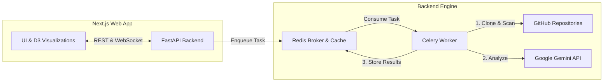

# 🏛️ Strata — AI Code Archaeology Platform

     

**Strata** is an advanced AI-powered code archaeology platform designed to analyze the entire git history of a repository. By extracting commit data, filtering noise, and leveraging Large Language Models, Strata reconstructs repository evolution, uncovers key historical "Eras," maps technical risk, and generates interactive guides to drastically accelerate new hire onboarding.

---

## ✨ Features

- **🔍 Git History Extraction**: Clones and deep-scans repositories using PyDriller, filtering out bot activity, automated linting, and trivial commits.
- **🤖 AI Era & Survival Guide Generation**: Analyzes commit logs via Google Gemini to categorize repo history into distinct architectural eras and creates automated "New Hire Survival Guides."
- **🗺️ Codebase Topography**: Interactive D3.js file tree visualization mapping out directory structures and complexity.
- **⏳ Time-Scrubbing Slider**: Scrub through historical repo states to visually witness the rise and fall of code modules over time.
- **🔥 Bus Factor Heatmap**: Identifies risk bottlenecks by highlighting modules authored and understood by single developers.
- **🎒 New Hire Mode**: Filters out deprecated or legacy files to present onboarding engineers with exactly what they need to succeed today.
- **⚡ Real-Time WebSocket Streaming**: Instantaneous progress reporting via WebSockets as Celery processes heavy repository cloning and LLM extraction pipelines.
- **📦 Fully Containerized**: Built with Docker & Docker Compose for seamless one-click local orchestration.

---

## 🏗️ Architecture



### Tech Stack
- **Frontend**: Next.js 16 (App Router), React 19, Tailwind CSS, Lucide Icons, D3.js
- **Backend API**: FastAPI, Uvicorn, WebSockets
- **Task Processing**: Celery asynchronous workers
- **Message Broker & Cache**: Redis 7
- **AI Integration**: Google Gemini API (`gemini-2.5-pro` / `gemini-1.5-flash`)

---

## 🚀 Getting Started (Local Development)

### Prerequisites
- [Docker](https://www.docker.com/) and Docker Compose
- A Google Gemini API Key (`GOOGLE_API_KEY`)

### Quickstart with Docker Compose

1. **Clone the repository:**
   ```bash
   git clone https://github.com/Amirtha-yazhini/strata.git
   cd strata
   ```

2. **Configure Environment Variables:**
   Create a `.env` file in the root directory:
   ```ini
   GOOGLE_API_KEY=your_gemini_api_key_here
   REDIS_URL=redis://redis:6379/0
   ```

3. **Spin up the stack:**
   ```bash
   docker-compose up --build
   ```

4. **Access the application:**
   - **Web App UI**: [http://localhost:3000](http://localhost:3000)
   - **FastAPI API Docs**: [http://localhost:8000/docs](http://localhost:8000/docs)

---

## 📂 Project Structure

```text
strata/
├── frontend/               # Next.js 16 Frontend
│   ├── app/                # Next.js App Router (Pages, Styling)
│   ├── components/         # React Components & D3 Visualizer (FileTreeGraph)
│   └── Dockerfile          # Frontend container configuration
├── analyzer.py             # LLM orchestration and era extraction logic
├── extractor.py            # Git commit extraction using PyDriller
├── main.py                 # FastAPI server & WebSocket handlers
├── tasks.py                # Celery worker definitions & pipeline runner
├── Dockerfile.backend      # Backend & Celery Worker container configuration
└── docker-compose.yml      # Multi-container orchestration
```

---

## 📡 API Endpoints

### `POST /api/analyze`
Triggers an asynchronous repository analysis.
```json
// Request Body
{ "repo_url": "https://github.com/user/repo" }

// Response
{ "job_id": "8472-a84b-...", "status": "Queued" }
```

### `GET /api/status/{job_id}`
Returns live status and final analysis JSON.

### `WS /api/ws/status/{job_id}`
Real-time WebSocket endpoint streaming updates and final results directly to the UI.

---

## 📜 License

Distributed under the MIT License. See `LICENSE` for more information.
